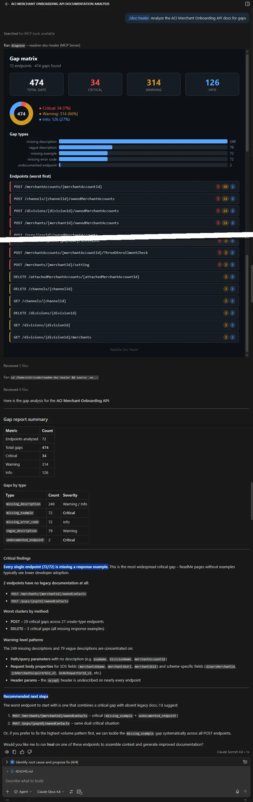
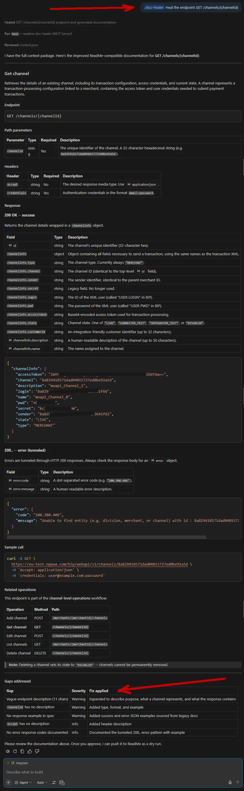
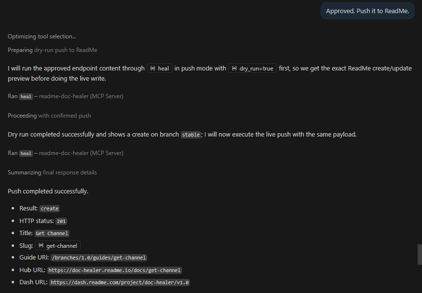
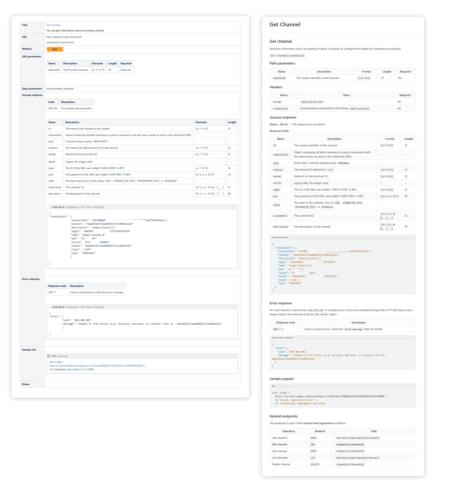
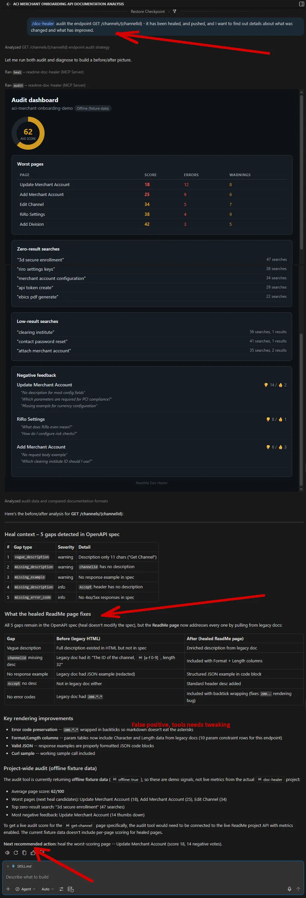

# ReadMe Doc Healer

An MCP server that diagnoses legacy API documentation gaps against an OpenAPI spec, assembles context for the host LLM to generate improved ReadMe-compatible content, and surfaces live quality signals from a ReadMe project – all from the IDE. Uses source data from the “ACI Web API” (example project).

<table>
  <thead>
    <tr>
      <th><kbd><b>/doc-healer</b></kbd> <sub>Analyze <br>the API docs for gaps</sub></th>
      <th><kbd><b>/doc-healer</b></kbd> <sub>Heal endpoint <br>GET /channels/{channelId}</sub></th>
      <th><sub>Push <br>(after dry run)</sub></th>
      <th><sub>Before / After <br>(pages)</sub></th>
      <th><sub>Before / After <br>(audit tool)</sub></th>
    </tr>
  </thead>
  <tbody>
    <tr>
      <td valign="top" align="center"><kbd></kbd></td>
      <td valign="top" align="center"><kbd></kbd></td>
      <td valign="top" align="center"><kbd></kbd></td>
      <td valign="top" align="center"><kbd></kbd></td>
      <td valign="top" align="center"><kbd></kbd></td>
    </tr>
  </tbody>
</table>


## Problem

The “Web API” exposes 72 endpoints. Two of them cover 1,252 configuration options (read and set). Not all have meaningful descriptions. Customer documentation has drifted from the spec. The frontend config manuals are not connected to the API calls. Many calls have no dedicated page. This “Doc Healer” MCP server was built to make the API more usable. `Diagnose` finds **474 documentation gaps** across API call operations, and further gaps across config-calls. `Heal` assembles the context so an LLM can write the fix, and pushes the improved data to ReadMe pages. `Audit` checks whether users noticed the improvement.

## Tools

### `diagnose`

Parses an OpenAPI spec and a directory of legacy docs (Confluence HTML exports). Produces a structured gap report: missing descriptions, vague parameters, missing examples, terminology drift, undocumented endpoints. When a `settings_recipes.json` file is available, also validates recipe quality – setting ID joins against the config lookup, related-recipe references, category consistency, and operation mapping.

- **Matching strategies:** path_exact (literal endpoint paths in HTML), filename_fuzzy (operation keywords in filenames), glossary_alias (business term normalization)
- **Vagueness detection:** rule-based heuristics with `needs_llm_review` flags for borderline cases
- **Recipe quality:** validates recipe catalog integrity, reports unresolved setting IDs, unmapped recipes, and broken cross-references
- **No API key needed** – local files only

### `heal`

Assembles structured context for a specific endpoint so the host LLM can generate documentation. Returns spec fragment, legacy doc snippets (redacted), gap entries, and workflow candidates.

- **Output modes:** `sectioned` (default, for review) or `bundled` (single blob)
- **Workflow detection:** chapter grouping from Confluence index.html, resource clustering from path segments
- **Push mode:** when `push=true`, creates or updates guide pages on ReadMe via the Refactored v2 API. Dry-run by default
- **No in-tool LLM calls** – the host LLM does the writing

### `audit`

Connects to a live ReadMe project and surfaces support-relevant quality signals: worst pages by quality score, zero-result searches, pages with negative feedback.

- **Live mode:** hits the ReadMe Metrics API at `metrics.readme.io` (requires Enterprise plan)
- **Offline mode:** loads canned fixture data for demo purposes
- **Triage-ready output:** markdown report with ranked lists

## MCP Apps

`diagnose` and `audit` render as interactive HTML5 visualizations via `ui://` scheme (`text/html;profile=mcp-app`). When the MCP client doesn't support MCP Apps, tools return plain JSON + markdown.

- **Gap matrix** (`ui://gap-matrix/{spec_path}/{docs_path}`):  
color-coded severity distribution, gap type bars, expandable endpoint details 
- **Audit dashboard** (`ui://audit-dashboard`):  
score gauge, worst pages table, failed searches, negative feedback


## Resources

| URI | Description |
|-----|-------------|
| `glossary://terms` | Business term glossary with aliases (example: Contact = user) |
| `endpoints://{spec_path}` | Endpoint index parsed from an OpenAPI spec |

### Example files and workflows
| File | Role |
| --- | --- |
| `glossary.json` | Resolves terminology drift (e.g., "Contact" = "User"). Diagnose uses it for matching; heal includes it in context |
| `riro_consolidated_lookup.json` | 1,225 config keys. Diagnose joins recipes against it, reports config quality (missing defaults, brittle UI paths, verbose default phrases) |
| `settings_recipes.json` | 7 recipes linking settings into end-to-end workflows. Diagnose validates recipe integrity (setting ID resolution, cross-references, category consistency) |

###

## Quick start

```bash
# clone and install
git clone <repo-url>
cd readme-doc-healer
python -m venv .venv && source .venv/bin/activate
pip install -e ".[dev]"

# configure local defaults in .env
# README_API_KEY=rdme_...     # optional - needed for push mode and live audit
# PROJECT_NAME="..."          # display name for the local demo/input project
# PROJECT_DIR="..."           # folder name under base_data/
# PERSIST_RESULTS=false       # optional - persist heal/diagnose/audit JSON to result_data/

# run the server
readme-doc-healer
```

### MCP client configuration

#### VS Code

Add to mcp.json:

```json
{
  "servers": {
    "readme-doc-healer": {
      "command": "${workspaceFolder}/.venv/bin/readme-doc-healer",
      "type": "stdio"
    }
  }
}

```

### Example workflow

```
> diagnose

474 gaps found across 72 endpoints.
Critical: 181, Warning: 246, Info: 47

> heal updateMerchantAccount

52 gaps for PUT /merchants/{merchantId}
Spec fragment, legacy snippets, and workflow candidates assembled.

> [LLM generates improved documentation from the context]

> heal --push --branch=1.0 --dry-run=false updateMerchantAccount ...
  content_markdown="# Update merchant account ..."

Guide created at https://doc-healer.readme.io/docs/update-merchant-account

> audit --offline

Triage report: 5 worst pages, 5 zero-result searches, 3 negative feedback pages
```

## Spec enrichment

In addition to the MCP tools, the repo includes a batch workflow for enriching the canonical OpenAPI spec with structured data extracted from the legacy Confluence export.

- `scripts/report_character_values.py` inventories raw `Character` column values from legacy docs and writes a JSON review report.
- `scripts/enrich_openapi.py` applies the reviewed Character mapping plus high-confidence enrichments for `pattern`, `enum`, `maxLength`, required fields, empty descriptions, response examples, request examples, error responses, and `x-enriched-from` traceability.
- Dry-run is the default. It writes a mapping summary report and leaves the spec untouched.
- Apply mode writes a candidate `.best.enriched.openapi.*` file plus a change report. Promotion to canonical `best` remains a manual review step.

Example commands:

```bash
python scripts/report_character_values.py \
  --docs base_data/ACI/Legacy-Documentation \
  --output result_data/enrich/aci-character-values.json

python scripts/enrich_openapi.py \
  --spec base_data/ACI/ACI\ Merchant\ Onboarding\ API.best.openapi.yaml \
  --docs base_data/ACI/Legacy-Documentation

python scripts/enrich_openapi.py \
  --spec base_data/ACI/ACI\ Merchant\ Onboarding\ API.best.openapi.yaml \
  --docs base_data/ACI/Legacy-Documentation \
  --apply
```

## From “reference docs” to “how do I actually enable a feature” - *Recipes*

Doc Healer supports [https://docs.readme.com/main/docs/recipes](recipes). Working towards recipes is extremely valuable. It takes the user from "this high quality documentation promises predictable results" to actually *getting the results*. Recipes are naturally tied to their API. We selected 7 common needs: 3D Secure, AVS validation, dupe detection, CVV validation, basic risk checking, basic Chargeback config, Account Updater.

The `diagnose` tool validates the recipe catalog. It checks that all `setting_id` references resolve against the config lookup, that `related_recipes` point to existing recipe IDs, and that each recipe's category appears in the top-level categories list. The summary output includes a `recipe_quality` block and a `worst_recipes` ranking. This shows which recipes need attention before publishing.

---

## Source data

The server resolves local data from `.env`:

- `PROJECT_NAME`: display label for the local project
- `PROJECT_DIR`: folder name under `base_data/`
- The server prefers `base_data/<PROJECT_DIR>/...`
- If empty, fallback to `base_data/`

Example layout:

```text
base_data/
  <PROJECT_DIR>/
    <OpenAPI spec file>
    Legacy-Documentation/
    glossary.json
    audit-fixture.json
    riro_consolidated_lookup.json
    settings_recipes.json
```

| File | Description |
|------|-------------|
| `[PROJECT_NAME].openapi.yaml` | Merged best-of OpenAPI spec (72 operations, 38 paths) |
| `Legacy-Documentation/` | Confluence HTML export (68 files) with `index.html` table of contents |
| `glossary.json` | 25 business terms with aliases, definitions, and context tags |
| `audit-fixture.json` | Canned metrics for offline audit demo |
| `riro_consolidated_lookup.json` | Optional – 1225 RiRo config keys with id, type, path, default. Drives the config quality card in diagnose |
| `settings_recipes.json` | Optional – recipe catalog (7 recipes, 3 categories) linking entity settings and merchant account fields into end-to-end workflows. Drives the recipe quality section in diagnose |


## Architecture

```
VS Code / IDE
+------------------------------------------+
| MCP Client (Claude, Copilot, etc.)       |
+---+--------------------------------------+
    | MCP protocol (stdio)
+---v--------------------------------------+
| readme-doc-healer (FastMCP)              |
|                                          |
|  +----------+ +------+ +---------+       |
|  | diagnose | | heal | |  audit  |       |
|  +----+-----+ +--+---+ +----+----+       |
|       |          |          |            |
|  +----v----------v--+  +----v----------+ |
|  | Spec + Doc Parser|  | ReadMe API v2 | |
|  | (local files)    |  | + Metrics API | |
|  +------------------+  +---------------+ |
+------------------------------------------+
```

### Decisions

#### Who calls the LLM

`Heal` does NOT call an LLM. It assembles context, and the host LLM generates the documentation.

#### Doc Healer vs Spec Healer

The OpenAPI specification is checked for vagueness, and rated for quality (`vagueness.py`). The separate `doc_scanner.py` is used for matching, snippet extraction, and finding structured data (param details, examples, error codes). `Heal` does not write back to the OpenAPI spec. The output is the *ReadMe guide page*, pushed to api.readme/v2. Design decision is: *The gap lives in the spec, the fix lands in ReadMe*. Spec Healer is a potential future tool. While this situation is present throughout, it's especially visible for the recently introduced "APO token operations". They are described in the "legacy" (official) documentation, and they work as expected. But: they are missing in the OpenAPI spec, because they have not officially been added to the Postman Collection that the "best version" of the OpenAPI spec is based on. This is exactly the kind of drift we are trying to fix.

#### Doc healing vs readme.io

Push mode (heal with push=true): Once the LLM generates improved documentation (and is approved), `heal` creates or updates guide pages on readme.io via the Refactored v2 API. This is how the fixes reach end users (default: dry-run).

Live `audit` (audit with offline=false): Pulls metrics from metrics.readme.io – page quality scores, zero-result searches, negative user feedback. This closes the loop: the Healer diagnoses, heals, pushes. The audit confirms if users noticed the improvement.

Without the readme.io connection - can't publish or measure.

#### Config quality

Only very limited details on config quality (key-based calls) are shown in Gap matrix. With 1252 (and growing) possible calls, it would not be useful to show them all. We show only samples, and add short notes. *Labels* and a *collapsible card* are used to distinguish endpoint-gap count and key-level count. The feature is - currently - directly tied to the presence of a file named "riro_consolidated_lookup.json". **Frontend breadcrumbs should be excluded entirely (may even be paid feature). Or, add a capability to export the full config lookup for external reference. Or, adjust the heal context to generate better linking text.**

#### Recipe quality

When `settings_recipes.json` is present, diagnose loads and validates the recipe catalog. Each recipe's `setting_id` values are joined against `ConfigLookupEntry.id` from the config lookup. Related-recipe references, category membership, and operation mapping (via `tool` fields as operationId hints) are cross-checked. The summary reports valid/invalid recipe counts, unresolved setting IDs, unmapped recipes, and per-category distribution. In `summary_only` mode, the top 5 worst recipes (by issue count) are included alongside the existing worst-endpoints list.

#### Why are missing examples "critical"

Missing examples in OpenAPI are flagged as **critical**, even when examples do exist in auxiliary docs. OpenAPI 3.x has explicit example fields on media type objects and schema objects. Tools like ReadMe, Swagger UI, Redocly render them. The spec missing examples is a genuine gap that needs to be healed. The *gap message* will note when a matched legacy doc has examples available (so the user/LLM knows where to source the fix). The *heal step* extracts the actual example JSON from legacy HTML (success response, error response, sample call) for the LLM to propose adding them to the OpenAPI spec.

#### Potential negative side-effects

Heal does not call an LLM itself (architecture decision). It assembles structured context (spec fragment, legacy snippets, gap entries, extracted examples, param constraints, error codes) and hands it to the host LLM. If the model is weak, it may misinterprete "aA" for alphabetic input even when literal string "aA" is expected (example). The guardrail is human review before push.

What reaches the end user? - **Only the ReadMe guide pages.** The `heal(push=true)` workflow creates/updates a **markdown guide page** on readme.io via the v2 API. It does NOT upload the OpenAPI spec to ReadMe. By default it writes no local result files. When `PERSIST_RESULTS=true`, the tool responses are also written locally under `result_data/` for session recovery and regression tracking. End users still only see the ReadMe guide pages.

#### Local store of wins

Set `PERSIST_RESULTS=true` in `.env` to persist tool output locally.

- `heal` writes JSON snapshots to `result_data/heal/`
- `diagnose` writes JSON snapshots to `result_data/diagnose/`
- `audit` writes JSON snapshots to `result_data/audit/`
- persisted filenames include a UTC timestamp plus a sanitized endpoint or tool name
- when persistence is on, tool responses include a `persisted_to` field with the written path


## Tech stack

- Python 3.11+, FastMCP 3.1
- `pyyaml` / `jsonref` for OpenAPI spec parsing
- `httpx` for ReadMe API calls
- `beautifulsoup4` / `lxml` for Confluence HTML parsing
- `pydantic-settings` for configuration
- MCP Apps: HTML5 in sandboxed iframe via `ui://` scheme

## Auth

| Surface | Base URL | Auth | Notes |
|---------|----------|------|-------|
| ReadMe API v2 | `api.readme.com/v2` | Bearer | Guides, categories, recipes, search, branches |
| Metrics API | `metrics.readme.io/v2` | Basic (key:) | Page quality, search terms – Enterprise only |

`diagnose` needs no API key. `heal` needs a key only for push mode. `audit` live mode needs an Enterprise-tier key; or fallback to fixture.

## See also

- [https://docs.readme.com/main/docs/readmes-mcp-server](ReadMe's MCP server) that also supports working from directly within the dev's IDE
- [https://readme.com/blog/mcp-servers](From IDE to AI: How ReadMe bridges APIs to LLMs with MCP)

---

8C830FBA